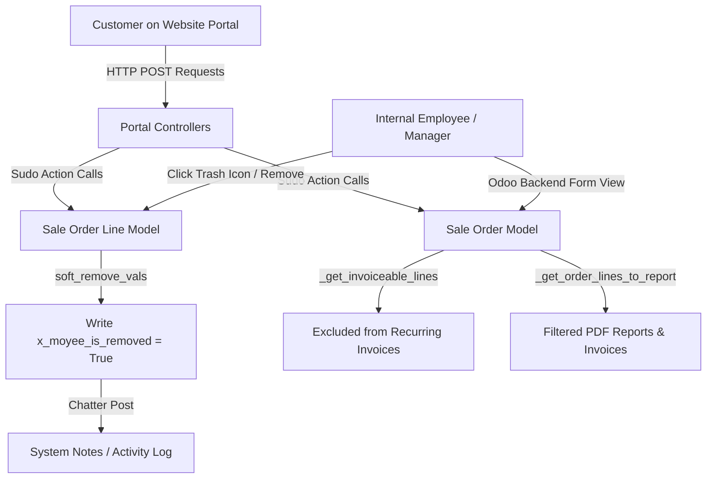

# Moyee Subscription Portal Manager: Complete Technical Documentation

This document serves as the comprehensive technical specification and architectural manual for the **Moyee Subscription Portal Manager** module (version `18.0.1.0.0`). Developed for Moyee Coffee, this module introduces an advanced "soft-remove" paradigm for subscription lines, filters backend and invoice layouts dynamically, and exposes a high-end customer self-service portal interface for secure subscription administration.

---

## 1. Module Overview & Architecture

The **Moyee Subscription Portal Manager** bridges the gap between customer-facing self-service capabilities and rigid backend ERP invoice generation. By utilizing a "soft-remove" pattern instead of standard record deletion, the system keeps a perfect history of subscription changes while shielding invoices, PDFs, and standard backend views from zero-quantity or discontinued lines.

### High-Level Architecture Flow



### Core Design Paradigms

1. **Soft-Removal Instead of Hard Deletion**: 
   When a subscription line is modified to a quantity of `0` or deleted by the customer/staff, it is marked with the `x_moyee_is_removed` flag. The ordered quantity is adjusted safely to match the delivered quantity (protecting against Odoo delivery constraints), keeping a historical ledger in the database rather than erasing the row.
2. **SaaS-Safe Universal Resolvers**:
   The module uses fallback reflection to dynamically resolve subscription states (`3_progress` vs `4_paused`) and plan fields (`plan_id` vs `recurring_plan_id`), making it extremely robust and multi-company/SaaS safe across minor Odoo 18 builds.
3. **Write-Through Security Guard**:
   All portal controllers bypass typical standard access rights using `.sudo()` ONLY after running rigorous validation checks. These checks ensure the logged-in user belongs to the exact commercial partner linked to the subscription, or holds a validated cryptographic `access_token` from a shared link.

---

## 2. Data Model & Fields Reference

The module extends two core sales models to support tracking, filtering, and backend reporting logic.

### sale.order.line ([sale_order_line.py](file:///Users/alihassan/Documents/Github/moyee_subscription_portal_manager/models/sale_order_line.py))

Custom fields are added with the `x_moyee_` prefix to isolate them from native sales fields.

| Field Name | Type | Label | Default | Description |
| :--- | :--- | :--- | :--- | :--- |
| `x_moyee_is_removed` | `Boolean` | Removed from Subscription | `False` | Triggers exclusion from backend order lines, invoices, and PDFs. |
| `x_moyee_removed_on` | `Datetime` | Removed On | `False` | Auditing timestamp recording when the line was soft-removed. |
| `x_moyee_removed_by` | `Many2one` (`res.users`) | Removed By | `False` | References the user (portal or internal staff) who initiated the removal. |
| `x_moyee_remove_reason`| `Text` | Remove Reason | `False` | Stores details on why the subscription line was removed. |

### sale.order ([sale_order.py](file:///Users/alihassan/Documents/Github/moyee_subscription_portal_manager/models/sale_order.py))

| Field Name | Type | Label | Compute/Domain | Description |
| :--- | :--- | :--- | :--- | :--- |
| `is_subscription_order` | `Boolean` | Is Subscription Order | `_compute_is_subscription_order` | Dynamic boolean detecting if the sale order is a subscription. |
| `moyee_removed_line_ids`| `One2many` | Removed Lines | `[('x_moyee_is_removed', '=', True)]` | Custom relation exposing only soft-removed lines for tab layout auditing. |

---

## 3. Backend Features & Soft-Removal Mechanism

### 1. Soft-Remove Action logic
Internal staff can soft-remove active lines via [action_moyee_soft_remove](file:///Users/alihassan/Documents/Github/moyee_subscription_portal_manager/models/sale_order_line.py#L86-L127) which runs the following sequence:
- Performs manager-rights check using `_moyee_check_manager_rights`.
- Prevents removal of delivery lines via `_moyee_block_delivery_product`.
- Safely sets product ordered quantity to match `qty_delivered` (preventing Odoo from throwing constraint exceptions).
- Writes metadata and commits a chatter message on the parent sale order.

### 2. Native Deletion Interceptor (`unlink()`)
If an internal employee clicks the native trash can icon on a confirmed subscription order line, the module intercepts the deletion in `unlink()` and converts it into a soft-removal:
```python
def unlink(self):
    to_soft_remove = self.filtered(
        lambda l: (
            not l.display_type
            and l.order_id
            and l._moyee_is_subscription_line()
            and l.order_id.state in ("sale", "done")
        )
    )
    if to_soft_remove:
        self._moyee_check_manager_rights()
        to_soft_remove._moyee_block_delivery_product()
        now = fields.Datetime.now()
        for line in to_soft_remove:
            line.write(
                line._moyee_soft_remove_vals(
                    self.env.user.id,
                    reason=_("Removed via line delete (auto converted to soft remove)."),
                    now=now,
                )
            )
            # Post chatter note ...
```

### 3. Double-Layer Backend Hiding
To keep the primary sale order form clean, soft-removed lines are hidden using a complementary double-layer system:
1. **Server-Side XML Domain**:
   The `order_line` field attribute in [sale_order_views.xml](file:///Users/alihassan/Documents/Github/moyee_subscription_portal_manager/views/sale_order_views.xml#L18-L27) applies a server domain filtering out zero-qty/soft-removed lines.
2. **Dynamic Client-Side MutationObserver**:
   A custom Javascript backend asset [hide_zero_qty_lines.js](file:///Users/alihassan/Documents/Github/moyee_subscription_portal_manager/static/src/js/hide_zero_qty_lines.js) listens to DOM changes on the order lines tree grid and applies a `.moyee_hide_line { display: none !important; }` style to any rows containing zero quantities. This guards against empty rows showing up during user addition/draft stages.

---

## 4. Portal Self-Service Features (Controllers & API)

The module implements a robust front-end controller in [portal.py](file:///Users/alihassan/Documents/Github/moyee_subscription_portal_manager/controllers/portal.py) mapped to `/my/subscriptions/<int:order_id>/moyee/manage`.

### Portal Security Check Flow

Whenever a portal user accesses a self-service route, the request passes through the secure `_moyee_portal_check_access` validator:

```
[Portal Request Received]
           │
           ▼
   Is Access Token valid? ── YES ──► [Access Granted]
           │ NO
           ▼
    Is User Employee? ───── YES ──► [Access Granted]
           │ NO
           ▼
    Is User Public? ─────── YES ──► [Abrupt 404 / Login Required]
           │ NO
           ▼
Commercial Partner check
Does Partner own order? ─── NO ───► [Access Denied (404)]
           │ YES
           ▼
  Order confirmed & active? ── NO ──► [Access Denied (ValidationError)]
           │ YES
           ▼
   [Access Granted]
```

### Self-Service Functions

#### A. Full Address Upsert (`moyee_portal_change_address_full`)
Customers can update their Shipping and Invoicing addresses. To prevent mutating shared historical addresses (which would corrupt other orders), the module creates a new child partner record (`type="delivery"` or `type="invoice"`) under the parent commercial contact when they save changes, and updates the specific `partner_shipping_id` and `partner_invoice_id` fields on that specific subscription:
- Includes a Javascript listener in [moyee_portal_filter.js](file:///Users/alihassan/Documents/Github/moyee_subscription_portal_manager/static/src/js/moyee_portal_filter.js#L73-L88) to copy shipping input directly to billing inputs in real-time when the "Use same address for invoicing" checkbox is toggled.

#### B. Next Delivery Date Postponement (`moyee_portal_push_next_date`)
Exposes a secure date picker that writes directly to the subscription's next shipment date field. The next date field name is resolved dynamically using the priority sequence: `recurring_next_date` ➔ `next_invoice_date` ➔ `next_delivery_date` ➔ `x_next_delivery_date`.

#### C. Change Subscription Interval (`moyee_portal_change_interval`)
Allows users to switch subscription frequencies. The controller detects the relevant relation in the database (e.g. `plan_id` in Odoo 18 Enterprise) and fetches available choices securely:
- Queries the parent plan's `optional_plans` if set, otherwise falls back to listing all available plans.
- Executed under a multi-company/SaaS safe context with `allowed_company_ids` to ensure portal users never see plans configured for other operating units.

#### D. Interactive Product Grid & Filtration
The "Add products" section features a sidebar filtering suite:
- **Grind Selection**: Whole Beans, Filter Grind, Espresso Grind, Capsules.
- **Weight Selection**: 1 kg, 250 gram, 25 Capsules.
- **Dynamic JavaScript Filtering**: Attributes and tags are extracted on the fly via `_moyee_extract_product_metadata` and injected as `data-` fields in the template card DOM. The [moyee_portal_filter.js](file:///Users/alihassan/Documents/Github/moyee_subscription_portal_manager/static/src/js/moyee_portal_filter.js#L90-L120) filter automatically controls card visibility locally without reloading the page.

#### E. Pause & Resume Subscription
Exposes quick actions to pause and resume the customer's subscription. Uses a robust universal resolver sequence to locate and apply paused states:
1. Direct write of `subscription_state` = `4_paused` (Odoo 18 native).
2. Tries standard methods: `action_pause()`, `action_suspend()`, or `action_subscription_pause()`.
3. Stage changes by scanning for stage records matching `"pause"`, `"suspend"`, or `"hold"`.
4. Selection value checks on `subscription_status` field.

---

## 5. Invoicing & PDF Filtering

The module implements deep safeguards to ensure soft-removed products do not show up on recurring invoices, customer statements, or generated invoice PDFs.

### 1. Invoicing Guard (`_get_invoiceable_lines`)
During subscription execution, when the cron job triggers invoice creation, the system overrides Odoo's standard `_get_invoiceable_lines` handler to strip out soft-removed lines:
```python
def _get_invoiceable_lines(self, final=False):
    lines = super()._get_invoiceable_lines(final=final)
    return lines.filtered(
        lambda l: l.display_type or (not l.x_moyee_is_removed and float(l.product_uom_qty or 0.0) > 0.0)
    )
```

### 2. PDF Print Guard (`report_invoice.xml`)
To prevent zero-quantity or soft-removed subscription lines from rendering on standard QWeb PDF layouts, [report_invoice.xml](file:///Users/alihassan/Documents/Github/moyee_subscription_portal_manager/reports/report_invoice.xml) inherits the base invoice template `account.report_invoice_document` and replaces the line iteration array with a lambda filter:
```xml
<xpath expr="//table[@name='invoice_line_table']//t[@t-foreach='lines']" position="attributes">
    <attribute name="t-foreach">
        lines.filtered(lambda l: l.display_type or (l.quantity &gt; 0 and not l.sale_line_ids.filtered(lambda sol: sol.x_moyee_is_removed)))
    </attribute>
</xpath>
```

---

## 6. Directory & File Structure Walkthrough

Below is the directory tree of the `moyee_subscription_portal_manager` module:

```text
moyee_subscription_portal_manager/
│
├── __init__.py
├── __manifest__.py                 # Odoo module metadata & assets registry
├── README.md                       # High-level module readme
│
├── security/
│   ├── security.xml                # "Moyee Subscription Manager" group definition
│   └── ir.model.access.csv         # Model access rights for managers
│
├── models/
│   ├── __init__.py
│   ├── sale_order.py               # Core sale.order overrides, security & API helpers
│   └── sale_order_line.py          # Soft-remove logic, unlink overrides & helpers
│
├── controllers/
│   ├── __init__.py
│   └── portal.py                   # Website portal HTTP/POST action controllers
│
├── views/
│   ├── sale_order_views.xml        # Backend Form modifications and removed-lines tab
│   └── portal_subscription_templates.xml # Frontend bootstrap portal templates layout
│
├── reports/
│   └── report_invoice.xml          # QWeb PDF print layout inheritance
│
└── static/
    └── src/
        ├── css/
        │   ├── hide_zero_qty_lines.css  # Backend hide classes style helper
        │   └── moyee_portal_subscription.css # Frontend portal custom responsive design
        └── js/
            ├── hide_zero_qty_lines.js   # Backend DOM MutationObserver line concealer
            └── moyee_portal_filter.js   # Client-side product grid filter widget
```

### Complete File Link Index

For developers and system administrators, these absolute file paths lead directly to each component:

*   **Manifest & Config:**
    *   [__manifest__.py](file:///Users/alihassan/Documents/Github/moyee_subscription_portal_manager/__manifest__.py)
*   **Python Models:**
    *   [sale_order.py](file:///Users/alihassan/Documents/Github/moyee_subscription_portal_manager/models/sale_order.py)
    *   [sale_order_line.py](file:///Users/alihassan/Documents/Github/moyee_subscription_portal_manager/models/sale_order_line.py)
*   **Web Portal Controllers:**
    *   [portal.py](file:///Users/alihassan/Documents/Github/moyee_subscription_portal_manager/controllers/portal.py)
*   **Security Definitions:**
    *   [security.xml](file:///Users/alihassan/Documents/Github/moyee_subscription_portal_manager/security/security.xml)
    *   [ir.model.access.csv](file:///Users/alihassan/Documents/Github/moyee_subscription_portal_manager/security/ir.model.access.csv)
*   **XML Views & Templates:**
    *   [sale_order_views.xml](file:///Users/alihassan/Documents/Github/moyee_subscription_portal_manager/views/sale_order_views.xml)
    *   [portal_subscription_templates.xml](file:///Users/alihassan/Documents/Github/moyee_subscription_portal_manager/views/portal_subscription_templates.xml)
    *   [report_invoice.xml](file:///Users/alihassan/Documents/Github/moyee_subscription_portal_manager/reports/report_invoice.xml)
*   **Frontend & Backend Assets:**
    *   [moyee_portal_filter.js](file:///Users/alihassan/Documents/Github/moyee_subscription_portal_manager/static/src/js/moyee_portal_filter.js)
    *   [moyee_portal_subscription.css](file:///Users/alihassan/Documents/Github/moyee_subscription_portal_manager/static/src/css/moyee_portal_subscription.css)
    *   [hide_zero_qty_lines.js](file:///Users/alihassan/Documents/Github/moyee_subscription_portal_manager/static/src/js/hide_zero_qty_lines.js)
    *   [hide_zero_qty_lines.css](file:///Users/alihassan/Documents/Github/moyee_subscription_portal_manager/static/src/css/hide_zero_qty_lines.css)

---

> [!NOTE]
> All custom fields, methods, and templates in this module have been developed in compliance with **LGPL-3** license specifications and **Odoo 18 Enterprise** best practices. For modifications, please make sure to inherit and preserve existing metadata hooks.
